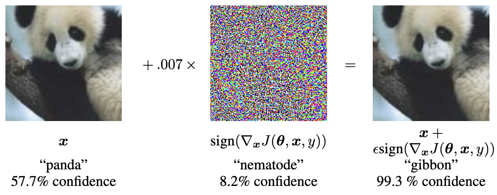

# Contents
1. [Initial Motivation](#inital-motivation)
2. [Some Formalization](#some-formalization)

## Initial Motivation

Let's take a look at an adversarial example from ImageNet applied to GoogLeNet [^1] from one of the first adversarial examples paper [^2]:

When we take a picture of a panda from ImageNet and add it to $0.007 \times$ some noise (that gets classified as a nematode), we get a classification of a gibbon. Now, this is a rather strange phenomenon since GoogLeNet should perform very well: it won the ILSVRC 2014 Classification Competition after all. And it is true that most images that look similar to a panda will be classified correctly, but it's possible to handcraft images that break its expected classification. This idea is precisely what an ***adversarial example*** is: an image that looks "normal" to humans but causes a machine learning model to misclassify.

## Some Formalization

Let's begin by reviewing the empirical risk minimization (ERM) framework for supervised learning. In ERM, we are given a dataset of $n$ samples $\mathcal{D} = \{(x_1, y_1), \dots, (x_n, y_n)\}$, where $x_i \in \mathcal{X}$ is a feature vector and $y_i \in \mathcal{Y}$ is a label. We assume that the samples are drawn i.i.d. from some joint distribution $\mathcal{P}$ over $\mathcal{X} \times \mathcal{Y}$. We also assume that there exists some function $f^* : \mathcal{X} \rightarrow \mathcal{Y}$ that minimizes the expected loss $\mathbb{E}_{(x, y) \sim D}[\ell(f(x), y)]$ for some loss function $\ell : \mathcal{Y} \times \mathcal{Y} \rightarrow \mathbb{R}$. The goal of ERM is to find a function $f : \mathcal{X} \rightarrow \mathcal{Y}$ that minimizes the empirical loss $\frac{1}{n} \sum_{i=1}^n \ell(f(x_i), y_i)$. In practice, most supervised learning algorithms takes the form of a dataset $\mathcal{D}$ with neural network $f$, which can be updated via gradient descent to minimize $\frac{1}{n} \sum_{i=1}^n \ell(f(x_i), y_i)$ where $\ell$ may be the log loss.

Now, this seems quite reasonable as a "best effort" attempt to find $f^*$ given our finite sample $\mathcal{D}$, and it certainly is! In practice, this framework has done extraordinarily well. But, in reality, we have only found an $f$ that closely models $\mathcal{D}$; what about $\mathcal{P}$, the actual distribution? Of course, this is the whole problem of machine learning: being able to generalize past the training set reasonably well into arbitrary samples from $\mathcal{P}$. But, there's some desirable restrictions on $f$: for $x \in \mathcal{X}$, all $x' \in \mathcal{X}$ that are indistinguishable from $x$ should satisfy $f(x) = f(x')$. One way to encapsulate "indistinguishable" is via a metric $d: \mathcal{X} \times \mathcal{X} \rightarrow \mathbb{R}$ where
$$ \forall x' \in \mathcal{X}: d(x, x') \leq \varepsilon, f(x) = f(x')$$
for some small $\varepsilon$. Immediately, an ***adversarial example*** is precisely those that violate this desirable property i.e. an
$$ x' \in \mathcal{X}: d(x, x') \leq \varepsilon, f(x) \neq f(x').$$

## Why Do We Care?

Outside of the nice mathematical properties, do these gaps in the topology actually matter?

## How to construct

One way to construct adversarial examples is by optimization to maximize the distance between $f(x')$ and $f(x)$ using $l$ as the metric. In other words, we can try to find 
$$
x' \in \argmax_{x' \in \mathcal{X}} l(f(x'), f(x)): d(x, x') \leq \varepsilon
$$
To simplify slightly, suppose $f(x) = y$ where $(x, y) \in \mathcal{D}$ i.e. $f$ classifies $(x, y)$ correctly. Or else, if $x$ is a clear picture, there's a bigger problem with $f$. Let us also take $d$ to be the $L_\infty$ metric. Now, we have
$$
x' \in \argmax_{x' \in \mathcal{X}} l(f(x'), y): \lVert x - x' \rVert_\infty \leq \varepsilon
$$
Ideally, we can use our familiar optimization techniques, but the constraint makes it a bit tricky. Geometrically, 

<svg width="200px" height="200px" xmlns="http://www.w3.org/2000/svg">
    <rect x="20" y="20" width="160" height="160" stroke="black" fill="none"/>

    <circle cx="100" cy="100" r="3" fill="black"/>

    <text x="105" y="105" font-family="Verdana" font-size="20" fill="black">x</text>

    <text x="80" y="15" font-family="Verdana" font-size="20" fill="black">2ε</text>

    <text x="5" y="35" fill="black">(±ε, ±ε)</text>
    <text x="165" y="35" font-family="Verdana" font-size="15" fill="black">(±ε, ±ε)</text>
    <text x="5" y="195" font-family="Verdana" font-size="15" fill="black">(±ε, ±ε)</text>
    <text x="165" y="195" font-family="Verdana" font-size="15" fill="black">(±ε, ±ε)</text>
</svg>

A little trick we can do is to always go to a corner. Intuitively, supposing $\varepsilon$ is small, when $x'$ is on a corner, it should maximize $l(f(x'), y)$.
$\varepsilon \cdot sgn(\nabla_x \ell(f(x'), y))$
This is the fast gradient sign method (FGSM) [^1], one of the first efficient algorithms to construct adversarial examples

## Threat Models
As per what's always important security, we must define our ***threat models*** first to understand our attack surface. Broadly, we classify them into
- White box: access to entire model of $f$
- Black box: model not available, only can query $f$

--

## Hypotheses

overfitting? cant be since it occurs in small models too
topological holes?
https://arxiv.org/pdf/1901.09496v1.pdf
linearity hypothesis?

## Transferability

One of the most interesting facts about these adversarial examples is their generalizability[^2] of _transferability_.

Typically, in the formulations before, we find specific adversarial perturbations per sample point.

There are perturbations that work across multiple different models and images and generalize to new ones.

The existence of these _universal adversarial perturbations_ [^3] gives surprising insight into the topology of neural networks.

## Attacks on LLMS

You may have seen the "jailbreaks" that bypass safety alignment in large language models (LLMs) such as **\_**TODO**\_**, and successfully reproduced them yourself. However, could you automatically find attacks that bypass alignment? In fact yes! you can and it displays similar findings to the traditional adversarial attacks.

## Attacks on Humans

If we can construct these adversarial examples for all neural nets, which are meant to approximate human intelligence, then that naturally brings up the question of whether humans have adversarial examples.

[^1]: https://arxiv.org/abs/1409.4842
[^2]: https://arxiv.org/abs/1412.6572
[^3]: https://openaccess.thecvf.com/content_cvpr_2017/papers/Moosavi-Dezfooli_Universal_Adversarial_Perturbations_CVPR_2017_paper.pdf
